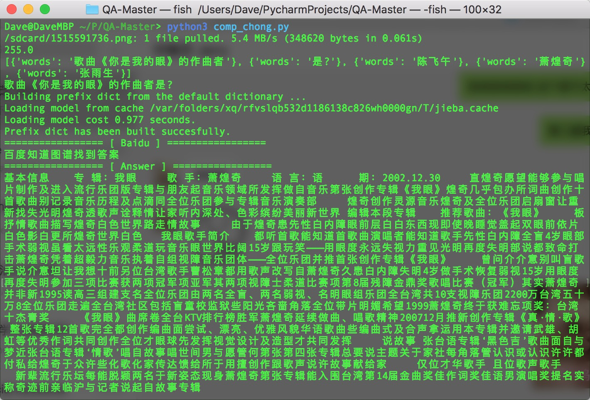

# QA-Master Ver 1.0

+ App Name: QA-Master
+ Version: 1.0 (20180111)
+ Author: dave.fang#outlook.com 

使用 adb 对手机屏幕进行截屏，使用 `百度 AI` 对问题进行 OCR 识别，并使用 [QA-Snake](https://github.com/SnakeHacker/QA-Snake) 对问题进行处理。

### 演示效果



### 使用说明

需要以下设备：

+ 开启 `开发者调试模式` 的 Android 手机一台
+ 装有 `adb` 及 `Python` 开发环境的电脑一台

本程序基于 `Python3` ，不保证 `Python2` 版本的运行。

```
pip3 install jieba aiml lxml requests beautifulsoup4 -U
pip3 install baidu-aip -U
```

**百度 OCR API 每天有 500 次免费调用机会，足够一天刷题使用。**

http://ai.baidu.com/tech/ocr/general

### 版权申明

本程序代码基于 MIT 协议，**禁止商业用途，包括并不限于淘宝等在线交易平台**。

欢迎商务合作，可以联系本人邮箱 dave.fang#outlook.com 。